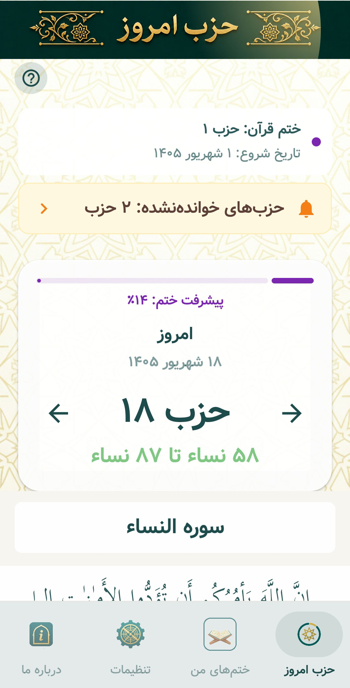
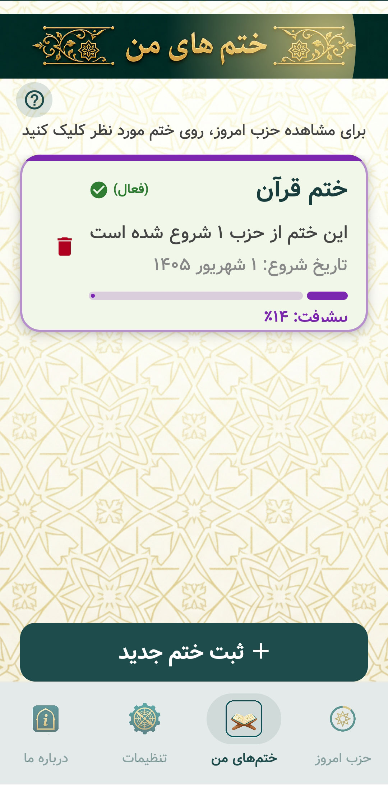
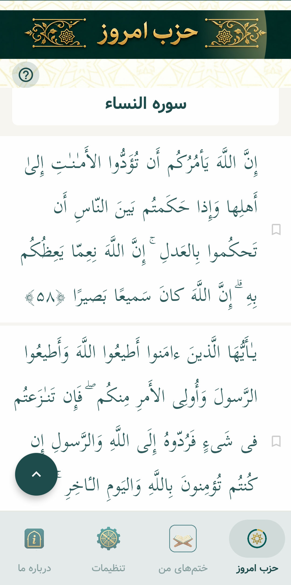
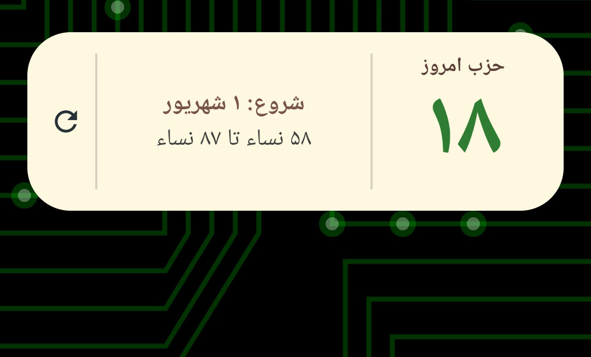

Khatm Quran

  

<h3 align="center">یک همراه ساده و فارسی برای برنامه‌ریزی و پیگیری ختم قرآن</h3>

  <a href="#قابلیتها">قابلیت‌ها</a> •
  <a href="#نصب-و-اجرا">نصب و اجرا</a> •
  <a href="#تصاویر-برنامه">تصاویر برنامه</a> •
  <a href="#مشارکت">مشارکت</a>

  
  
  
  
  

## معرفی

**ختم قرآن** یک اپلیکیشن اندرویدی فارسی برای ساخت و مدیریت چند برنامه ختم، مشاهده حزب روز، مطالعه آیات قرآن با ترجمه فارسی و پیگیری روند پیشرفت است. اطلاعات اصلی ختم‌ها و تنظیمات مطالعه به‌صورت محلی روی دستگاه ذخیره می‌شوند.

> این پروژه متن و ترجمه قرآن را از فایل‌های موجود در پوشه `app/src/main/assets` بارگذاری می‌کند. برای انتشار عمومی، منبع و مجوز استفاده از هر دو فایل را در بخش منابع پروژه به‌طور شفاف ثبت کنید.

## قابلیت‌ها

- ساخت، مدیریت و آرشیو چند ختم هم‌زمان
- محاسبه خودکار حزب روز بر اساس تاریخ شروع و حزب ابتدایی
- نمایش متن قرآن به زبان عربی همراه با ترجمه فارسی
- جابه‌جایی بین حزب روز قبل، امروز و روز بعد
- نشانک‌گذاری و ادامه مطالعه از محل قبلی
- تغییر اندازه متن قرآن و پشتیبانی از حالت مطالعه تیره
- بزرگ‌نمایی متن با حرکت دو انگشتی
- یادآور روزانه و ارسال اعلان مطالعه
- ویجت «حزب امروز» روی صفحه اصلی اندروید
- انتخاب تاریخ با تقویم شمسی
- رابط کاربری راست‌به‌چپ و مناسب زبان فارسی
- بخش درباره برنامه و ارسال بازخورد

## تصاویر برنامه

> تصاویر نهایی محصول را در مسیر `docs/screenshots/` قرار دهید و نام فایل‌ها را مطابق نمونه‌های زیر بگذارید. در حال حاضر چند تصویر گرافیکی پروژه برای پیش‌نمایش در مخزن موجود است.

| صفحه اصلی و حزب امروز | ختم‌های من |
|:---:|:---:|
|  |  |
  
| فرآن | ویجت |
|:---:|:---:|
|  |  |
